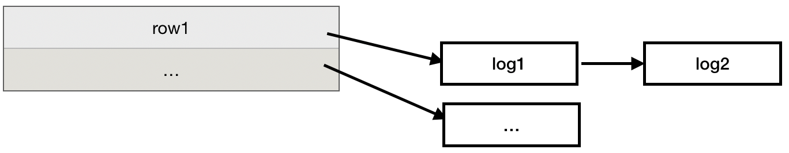
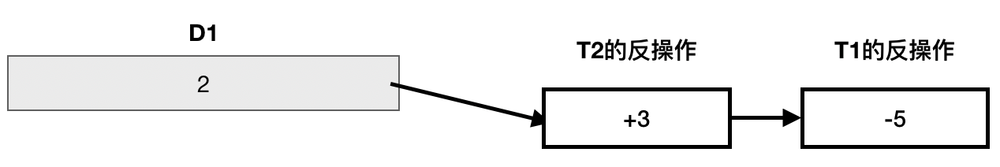
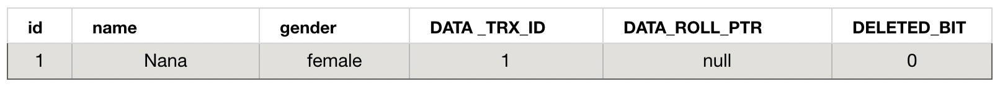
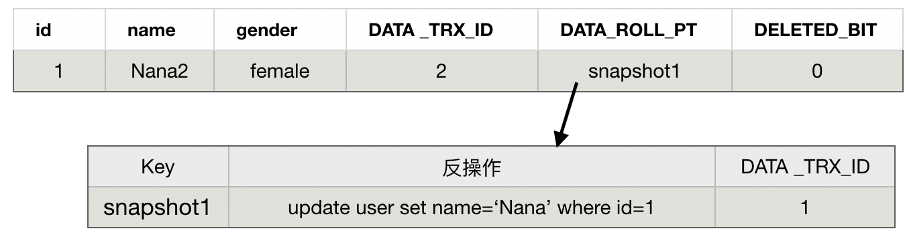
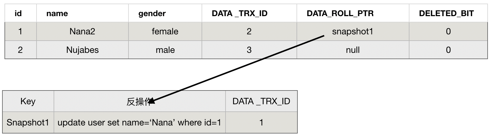

# MVCC
# InnoDB中的MVCC

[TOC]

## 事务ID

innoDB维护了一个系统版本号,每开始一个事务,系统版本号都会递增作为这个事务的ID.

## 数据行的结构

Innodb引擎会为每一行添加3个隐藏字段

| ~             | ~                                  |
| ------------- | ---------------------------------- |
| DATA _TRX_ID  | 表示产生当前记录项的事务ID         |
| DATA_ROLL_PTR | 一个指向此条记录项的undo信息的指针 |
| DELETED_BIT   | 用于标识该记录是否被删除。         |

## UndoLog

增量保存每一次更新操作的修改.每当更新记录时,直接在操作叶节点的数据行(不论有没有提交),同时会产生一条undo记录来记录这次更新的「反操作」. 被修改的数据行会指向这个「反操作」.

值得一提的是,反操作可以有多个,是一个链状结构.一个可能的结构如下:



那么一个事务内如何根据「反操作链表」得到它所可见的数据版本呢?

我们假设有事务 T1、T2,数据D1初始值为0.


T1对D1做一次+5,并提交(这是为了释放锁),产生的log如下:


T2对D1做一次-3,产生的log如下:



现在假设有一个事务要读取T1修改前的版本,则遍历链表并逐个计算,通过`2+3-5`即可得到.

现在假设有一个事务要读T2修改前的版本,通过`2+3`即可得到.

> 上面的例子里,你可能会认为事务T1提交以后就把对应的log清除了,事实上并不是这样, 是否清除的先决条件是这个log是否还被被某个事务依赖.

## ReadView

**每当「开始一个事务」[^1]或「创建一个行」时(取决于隔离级别),创建一个ReadView**.结构如下:

| ~              | ~                                         |
| -------------- | ----------------------------------------- |
| creator_trx_id | 创建这个ReadView事务id                    |
| trx_ids        | 创建当前ReadView时,所有活跃的事务的id列表 |
| m_trx_ids      | `trx_ids`列表长度                         |
| up_limit_id    | 创建当前ReadView时,活跃事务的最小id       |
| low_limit_id   | 创建当前ReadView时,活跃事务的最大id       |

**creator_trx_id:**  创建这个ReadView事务id                    
**trx_ids:**         创建当前ReadView时,所有活跃的事务的id列表 
**m_trx_ids:**       `trx_ids`列表长度                         
**up_limit_id:**     创建当前ReadView时,活跃事务的最小id       
**low_limit_id:**    创建当前ReadView时,活跃事务的最大id       


[^1]: 准确的说,是开始事务后,执行了`Select`后才建立`ReadView`,使用`START TRANSACTION WITH CONSISTENT SNAPSHOT`可以提前创建.

判断可见性规则如下:

```js
IsVisible(trx_id)
    //该数据行是否是当前事务创建, 则可见
    if (trx_id == creator_trx_id)  
        return true;
    //创建该数据行的事务在 「当前事务的ReadView创建之前」已经提交, 则可见
    else if (trx_id < up_limit_id)   
        return true;
    // 创建该数据行的事务在 「当前ReadView创建之后开始(不论有没有提交)」,则不可见.
    else if (trx_id > low_limit_id)  
        return false;
    // 创建该数据行的事务在 「当前ReadView创建时未提交」,则不可见.
    else if (trx_id is in m_ids)
        return false         
    // 提交该数据的事务 在「当前事务之后创建」, 且「当前事务的ReadView创建之前提交」
    else
        return true;

```

> 以上伪代码出处👉 [知乎用户「郭华」的回答](https://www.zhihu.com/question/263820564/answer/289269082)

## 示例

以下面的表为例子

```sql
CREATE TABLE `user` (
  `id` int(11) NOT NULL AUTO_INCREMENT,
  `name` varchar(20) DEFAULT NULL,
  `gender` enum('male','female') DEFAULT NULL,
  PRIMARY KEY (`id`)
) ENGINE=InnoDB
```

### 1. Multi-Version的产生过程

1. 开启事务A,插入一条数据

    ```sql
    begin;
    insert into user values(null,'Nana','female')
    commit;
    ```

    假设事务A的id为「1」,则表的的状态如下

    

    > 这里忽略了事务A产生的undolog,因为insert的undolog会在提交以后被删除.

2. 开启事务B,修改一条数据,并假设事务B的id为「2」.

    ```sql
    begin;
    update user set name='Nana2' where id=1;
    ```

    此时会向undolog加一条「反操作」记录用于记录旧版本的数据,而事务B的修改将直接落地到数据行,并指向刚才产生的快照,则此时表的的状态如下

    
  
3. 事务C开始,执行修改,假设分配的事务id为「3」

    ```sql
    begin;
    insert into user values(2,'Nujabes','male');
    ```

    此时会向`undolog`加一条「反操作」记录,插入的数据会直接插入到叶子页,此时表中的数据状态如下

    

### 2. 判断可见性的过程

1. 事务D开始,执行查询,假设分配的事务id为「4」

    ```sql
    begin;
    select * from user;
    ```

    此时会为事务D创建一个「ReadView」

    | creator_trx_id | trx_ids | m_trx_ids | up_limit_id | low_limit_id |
    | -------------- | ------- | --------- | ----------- | ------------ |
    | 4              | [2,3]   | 2         | 2           | 3            |

    > 读者可对照前文对「ReadView」的介绍来理解上面的表格内容,这里不再赘述.

2. 为了测试隔离性的效果,我们提交一下事务C,此时插入的undolog将被删除,表状态如下:

    

3. 接下来就可以开始遍历「数据行」和「undolog」了,并逐一判断可见性,具体过程如下:

    1. 「数据行」第一行是不可见的,判断过程如下

        - 第一行记录如下

            | id  | name  | gender | DATA _TRX_ID | DATA_ROLL_PTR | DELETED_BIT |
            | --- | ----- | ------ | ------------ | ------------- | ----------- |
            | 1   | Nana2 | female | 2            | snapshot1     | 0           |
        - 分析可见性

            ```js
            //根据现在的数据状态,第一行的trx_id为2
            trx_id = 2
            //该数据行是否是当前事务创建?
            if (trx_id == creator_trx_id)  //2 == 4  flase
                return true;
            //该数据行是否在当前ReadView创建之前已经提交?
            else if (trx_id < up_limit_id)    //2 < 2   false
                return true;
            //该数据行是否是否在当前ReadView创建之后产生的?
            else if (trx_id > low_limit_id)  //2 > 3 false
                return false;
            //该数据行是否在当前ReadView创建前「产生但未提交」或者之后 「产生(不管有没有提交)」?
            else if (trx_id is in m_ids)  // 2 in [2,3] true
                return false         // ❌ 该数据不可见
            // 省略后面不会执行的代码
            ```

    2. 「第一行指向的undolog记录」是可见的,判断过程如下

        - undolog记录如下

            | key       | 反操作                                   | DATA _TRX_ID |
            | --------- | ---------------------------------------- | ------------ |
            | snapshot1 | update user set name=‘male’ where id=1 | 1            |

        - 判断undolog的可见性

            ```js
            //快照行的trx_id为1
            trx_id = 1
            //该数据行是否是当前事务创建?
            if (trx_id == creator_trx_id)  //1 == 4  flase
                return true;
            //该数据行是否在当前ReadView创建之前已经提交?
            else if (trx_id < up_limit_id)    //1 < 2   true
                return true;   // 　✅ 该数据可见
            // 省略后面不会执行的代码
            ```

        - 执行反操作后得到如下数据,将放入「查询结果集」

            | id  | name | gender | DATA _TRX_ID | DATA_ROLL_PTR | DELETED_BIT |
            | --- | ---- | ------ | ------------ | ------------- | ----------- |
            | 1   | Nana | female | 1            | snapshot1     | 0           |

    3. 判断「第二行」的可见性,结果为false,具体过程如下

        - 第二行数据如下

            | id  | name    | gender | DATA _TRX_ID | DATA_ROLL_PTR | DELETED_BIT |
            | --- | ------- | ------ | ------------ | ------------- | ----------- |
            | 1   | Nujabes | male   | 3            | snapshot2     | 0           |

        - 判断可见性

            ```js
            //根据现在的数据状态,第一行的trx_id为3
            trx_id = 3
            //该数据行是否是当前事务创建?
            if (trx_id == creator_trx_id)  //3 == 4  flase
                return true;
            //该数据行是否在当前ReadView创建之前已经提交?
            else if (trx_id < up_limit_id)    //3 < 2   false
                return true;
            //该数据行是否是否在当前ReadView创建之后产生的?
            else if (trx_id > low_limit_id)  //3 > 3 false
                return false;
            //该数据行是否在当前ReadView创建前「产生但未提交」或者之后 「产生(不管有没有提交)」?
            else if (trx_id is in m_ids)  // 3 in [2,3] true
                return false         // ❌ 该数据不可见
            // 省略后面不会执行的代码
            ```

    4. 遍历第二行指向的undolog,由于是`insert`的反向操作(即`delete`),可直接判定不可见.

4. 事务D的最终的查询结果如下

    | id  | name | gender | DATA _TRX_ID | DATA_ROLL_PTR | DELETED_BIT |
    | --- | ---- | ------ | ------------ | ------------- | ----------- |
    | 1   | Nana | female | 1            | snapshot1     | 0           |


我们概括一下上述过程:

1. 事务A插入「数据1」并提交
2. 事务B修改「数据1」
3. 事务C插入数据2
4. 事务D开始
5. 事务C提交

> 此时事务B、D都处于未提交状态

根据ACID中的「I」,事务D查看不到B的修改、RR级别查下查看不到C已提交的插入[^2]. 只能查看到事务A提交「数据1」(即旧数据,也称为快照)

[^2]: 这是因为RC级别下每次查询都重新生成ReadView,如果读者觉得疑惑,建议自己画图推演一下.


## 其他

**如何理解Read Committed下,每条查询产生一个Read View**?

如果一个事务内只创建一次ReadView,ReadView里存的始终是「创建ReadView那一刻」的旧的信息, 则即使后面有事务提交了也无法感知,只有更新ReadView,刷新"当前活跃的事务"(也即是「trx_ids」)才可能符合可见性的判定从而读到已提交的数据.

## 最后

本文只是讲解 「undolog的内部结构」、「可见性判断规则」.事实上还有「undolog的回收机制」也是一个值得思考的问题.